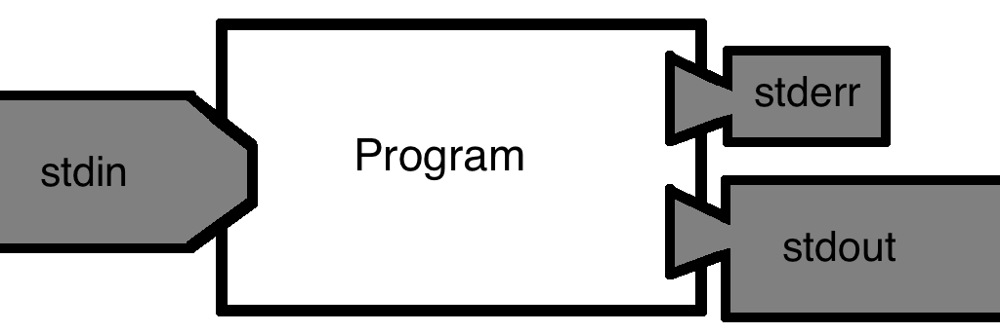
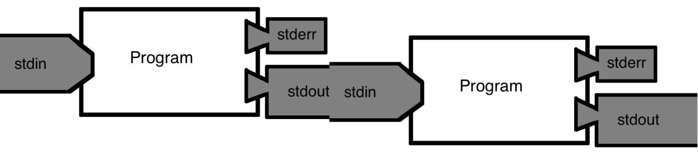

## A aula

:::: {.columns}
::: {.column width="50%"}
### 0–30 min

Terminal e navegação

### 60–90 min

Ajuda, pipes e busca
:::

::: {.column width="50%"}
### 30–60 min

Arquivos e FASTQ

### 90–120 min

Variáveis e automação
:::
::::

::: {.notes}
Mostre o percurso. A aula alterna explicação curta e execução no terminal. Tempo sugerido: 2 minutos.
:::

## Terminal, shell e Bash

:::: {.columns}
::: {.column width="33%"}
### Terminal

Janela para digitar comandos.
:::

::: {.column width="33%"}
### Shell

Programa que interpreta os comandos.
:::

::: {.column width="33%"}
### Bash

Uma shell comum em Linux e macOS.
:::
::::

```bash
echo "Alô, mundo"
```

::: {.notes}
Abra o terminal e execute o primeiro echo. Tempo sugerido: 4 minutos.
:::

## Cinco combinados

1. Deixe o computador repetir o serviço.
2. Consulte a documentação.
3. Registre o que você fez.
4. Espere erros de digitação.
5. Confira antes de apagar.

::: {.notes}
Use os combinados como contrato da prática. Tempo sugerido: 3 minutos.
:::

## O prompt

::: {.big-code}
```text
allysson@labbat:~$
```
:::

| Trecho | Significado |
|---|---|
| `allysson` | usuário |
| `labbat` | máquina |
| `~` | diretório pessoal |
| `$` | aguarda um comando |

> Não copie o `$` mostrado nos exemplos.

::: {.notes}
Mostre prompts diferentes e explique o papel do cifrão. Tempo sugerido: 3 minutos.
:::

## Comentários

::: {.big-code}
```bash
# O Bash ignora tudo depois do hashtag
pwd   # mostra o diretório atual
```
:::

Comentários explicam decisões e deixam o histórico compreensível.

::: {.notes}
Digite uma linha iniciada por hashtag. Tempo sugerido: 2 minutos.
:::

## Onde estou?

::: {.big-code}
```bash
$ pwd
/home/allysson
```
:::

`pwd` significa *print working directory*.

::: {.notes}
Todos executam pwd. Tempo sugerido: 3 minutos.
:::

## O que há aqui?

```bash
ls
ls -l
ls -lah
```

| Opção | Resultado |
|---|---|
| `-l` | detalhes |
| `-a` | itens ocultos |
| `-h` | tamanhos legíveis |

Use `Tab` para completar nomes.

::: {.notes}
Compare as três formas e demonstre Tab e histórico. Tempo sugerido: 4 minutos.
:::

## Caminhos absolutos e relativos

:::: {.columns}
::: {.column width="50%"}
### Absoluto

```text
/home/ana/projeto/dados
~/projeto/dados
```

Parte da raiz ou do diretório pessoal.
:::

::: {.column width="50%"}
### Relativo

```text
dados
./dados
../outro_projeto
```

Parte do diretório atual.
:::
::::

*Praça do Ferreira ou a esquina onde você já está?*

::: {.notes}
Use a analogia da rota. Demonstre ponto e dois pontos. Tempo sugerido: 5 minutos.
:::

## Navegação com `cd`

:::: {.columns}
::: {.column width="60%"}
```bash
cd Documents
cd ..
cd ~
cd -
```
:::

::: {.column width="40%"}
### Desafio

Entre em uma pasta, confirme o caminho e volte ao diretório anterior.
:::
::::

::: {.notes}
Demonstre cada forma de cd. Reserve dois minutos para o desafio. Tempo total: 5 minutos.
:::

## O espaço da aula

```bash
mkdir -p ~/aula_bash/dados
mkdir -p ~/aula_bash/resultados
cd ~/aula_bash
touch diario_de_bordo.txt
```

`mkdir` cria diretórios. `touch` cria um arquivo vazio.

::: {.notes}
A turma cria a estrutura. Tempo sugerido: 4 minutos.
:::

## Copiar, mover e renomear

```bash
cp diario_de_bordo.txt resultados/copia.txt
mv diario_de_bordo.txt notas_da_aula.txt
```

Origem primeiro, destino depois.

::: {.notes}
Execute cp e mv. Verifique com ls antes e depois. Tempo sugerido: 4 minutos.
:::

## Remoção sem aperreio

```bash
rm arquivo.txt
rm -r diretorio
```

1. Use `pwd` para confirmar onde está.
2. Use `ls` para visualizar o alvo.
3. Só então use `rm`.

::: {.notes}
Explique que rm não passa pela lixeira. Não demonstre rm -rf. Tempo sugerido: 4 minutos.
:::

## Anatomia de um FASTQ

:::: {.columns}
::: {.column width="55%"}
::: {.big-code}
```text
@leitura_1
ACGTTGCA
+
FFFFFFFF
```
:::
:::

::: {.column width="45%"}
1. identificador
2. sequência
3. separador
4. qualidade
:::
::::

Uma leitura ocupa quatro linhas.

::: {.notes}
Explique as quatro linhas e a correspondência entre sequência e qualidade. Tempo sugerido: 4 minutos.
:::

## FASTQ didático

::: {.small-code}
```bash
cat > dados/amostra_A.fastq <<'EOF'
@leitura_1
ACGTTGCA
+
FFFFFFFF
@leitura_2
GGCATGCA
+
HHHHHHHH
EOF
```
:::

O exemplo não depende de acesso à internet.

::: {.notes}
Copie o bloco inteiro e confira com cat. Tempo sugerido: 4 minutos.
:::

## Inspeção de texto

| Comando | Resultado |
|---|---|
| `cat arquivo` | conteúdo completo |
| `head -n 4 arquivo` | primeiras linhas |
| `tail -n 4 arquivo` | últimas linhas |
| `wc -l arquivo` | quantidade de linhas |
| `less arquivo` | leitura paginada |

::: {.notes}
A turma executa os cinco comandos. Demonstre busca e saída no less. Tempo sugerido: 6 minutos.
:::

## Arquivos compactados

```bash
cat > dados/amostra_B.fastq <<'EOF'
@leitura_1
ACGAAGCA
+
FFFFFFFF
@leitura_2
GGCATCGT
+
HHHHHHHH
EOF
gzip dados/amostra_B.fastq
zcat dados/amostra_B.fastq.gz | head
```

`zcat` lê o conteúdo sem descompactar no disco.

> No macOS, use `gzcat` se `zcat` não aceitar arquivos `.gz`.

::: {.notes}
Faça uma cópia antes de gzip. Tempo sugerido: 4 minutos.
:::

## O computador também explica os comandos

:::: {.columns}
::: {.column width="50%"}
```bash
man grep
```
:::

::: {.column width="50%"}
```bash
grep --help
```
:::
::::

{fig-alt="Cachorro fantasiado de cientista" width="42%" fig-align="center"}

::: {.notes}
Abra man grep. Mostre busca com barra e saída com q. Tempo sugerido: 4 minutos.
:::

## Entrada, saída e erro

{fig-alt="Fluxos stdin, stdout e stderr" width="88%" fig-align="center"}

::: {.notes}
Explique os três fluxos. Tempo sugerido: 4 minutos.
:::

## Pipe

{fig-alt="A saída de um programa alimenta a entrada de outro" width="92%" fig-align="center"}

```bash
zcat amostra.fastq.gz | grep '^@' | wc -l
```

Leia, filtre e conte.

::: {.notes}
Construa o comando em três etapas. Tempo sugerido: 6 minutos.
:::

## Busca com `grep`

```bash
grep 'TGCA' dados/amostra_A.fastq
grep -n 'TGCA' dados/amostra_A.fastq
grep -c '^@' dados/amostra_A.fastq
```

`^` significa início da linha.

> Em FASTQ real, uma linha de qualidade também pode começar com `@`.

::: {.notes}
Teste busca, número da linha e contagem. Tempo sugerido: 6 minutos.
:::

## Redirecionamento

```bash
grep '^@' amostra.fastq > ids.txt
echo 'nova linha' >> ids.txt
```

| Operador | Efeito |
|---|---|
| `>` | cria ou substitui |
| `>>` | acrescenta ao final |

::: {.notes}
Demonstre os dois operadores em um arquivo temporário. Tempo sugerido: 4 minutos.
:::

## Links simbólicos

```bash
ln -s ~/aula_bash/dados/amostra_A.fastq \
      ~/aula_bash/resultados/amostra_A.fastq
```

O link aponta para o arquivo original sem duplicar os dados.

::: {.notes}
Use ls -l para mostrar a seta. Remova apenas o link e confirme que o original permanece. Tempo sugerido: 4 minutos.
:::

## Variáveis

:::: {.columns}
::: {.column width="55%"}
```bash
projeto="aula_bash"
echo "$projeto"
```
:::

::: {.column width="45%"}
```bash
echo "$HOME"
echo "$USER"
echo "$SHELL"
```
:::
::::

Sem espaços ao redor de `=`. Use aspas em caminhos.

::: {.notes}
Compare echo HOME com echo $HOME. Tempo sugerido: 5 minutos.
:::

## Asteriscos

:::: {.columns}
::: {.column width="50%"}
### `*`

Zero ou mais caracteres.

```bash
ls dados/*.fastq
```
:::

::: {.column width="50%"}
### `?`

Exatamente um caractere.

```bash
ls dados/amostra_?.fastq
```
:::
::::

Visualize os alvos antes de combinar asteriscos e `rm`.

::: {.notes}
Teste os asteriscos e use printf para visualizar a expansão. Tempo sugerido: 4 minutos.
:::

## Loop `for`

```bash
for fastq in dados/*.fastq; do
  linhas=$(wc -l < "$fastq")
  leituras=$(( linhas / 4 ))
  echo "$fastq tem $leituras leituras"
done
```

Um arquivo por vez, a mesma tarefa e um resumo por arquivo.

::: {.notes}
Comece com echo para ensaiar o laço. Depois execute a contagem. Tempo sugerido: 7 minutos.
:::

## Desafio final

Crie `resultados/resumo.tsv`:

```text
arquivo                   linhas
dados/amostra_A.fastq     8
dados/amostra_C.fastq     8
```

Use `for`, `wc -l` e `>>`.

### Bora automatizar, sem aperreio

::: {.notes}
Reserve sete minutos para tentativa em dupla. Depois construa a solução com a turma. Tempo total: 13 minutos.
:::

## Créditos

Material adaptado de [Bare Bones Bash](https://github.com/BareBonesBash/barebonesbash.github.io), de James A. Fellows Yates e Thiseas C. Lamnidis.

Licença [Creative Commons Atribuição CompartilhaIgual 4.0 Internacional](https://creativecommons.org/licenses/by-sa/4.0/).

